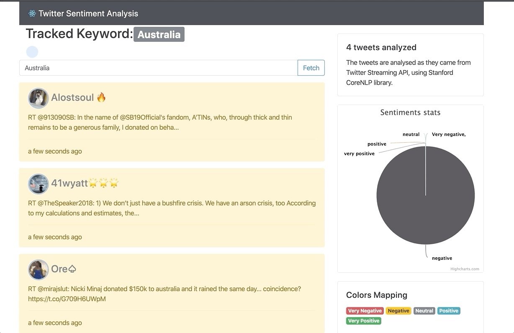

# Tweet Sentiment Analysis

Sentiment analysis for live stream tweets, using [Twitter4J](http://twitter4j.org/), [Stanford CoreNLP library](https://stanfordnlp.github.io/CoreNLP), [Spring Boot](https://spring.io/projects/spring-boot) and [ReactJs](https://reactjs.org/)!
More details on this [blog post](https://aboullaite.me/stanford-corenlp-java/)

### Running the app

Make sure to update to update `application.yaml` file with the required keys that will allow you to authenticate correctly when calling the Twitter API to retrieve tweets. You probably need to create a [Twitter developer account](https://developer.twitter.com/) and create an application.

Start afterward the backend server using `mvn spring-boot:run` and the frontend `npm start`.
